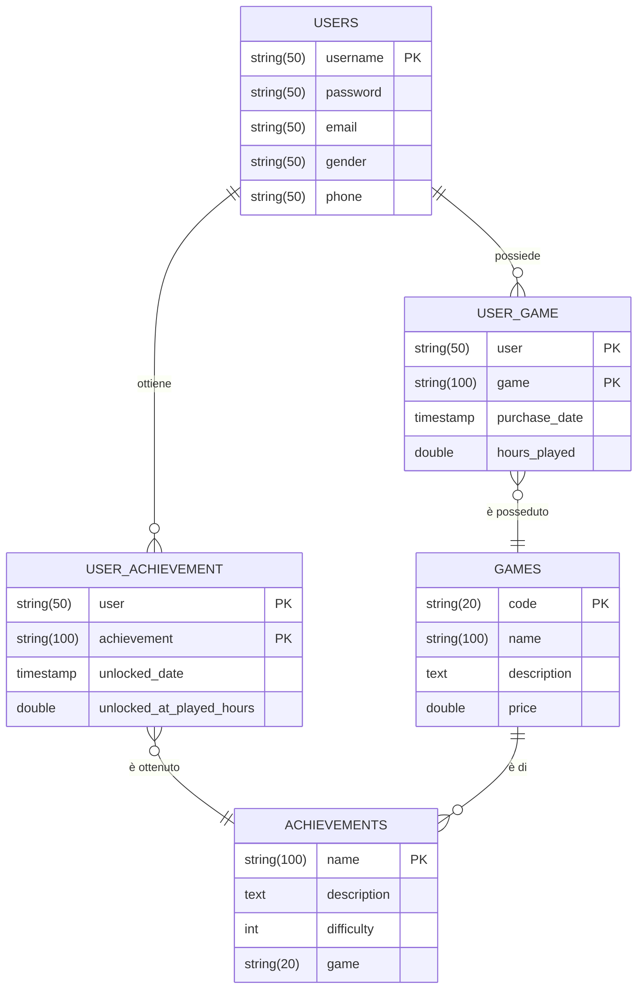

# Progetto BD2
Authors:
* Iacopo Filiberto <iacopo.filiberto@gmail.com> (S4472942)
* Davide Cardo <davidecardo98@gmail.com> (S4516525)

## PARTE A
1) Come DBMS abbiamo scelto di utilizzare PostgreSQL
2) Abbiamo scelto di modellare una possibile base dati di un sito web volto al
tenere traccia degli obbiettivi di videogiochi ottenuti dagli utenti della piattaforma.

## PARTE B
## PARTE C
## PARTE D
