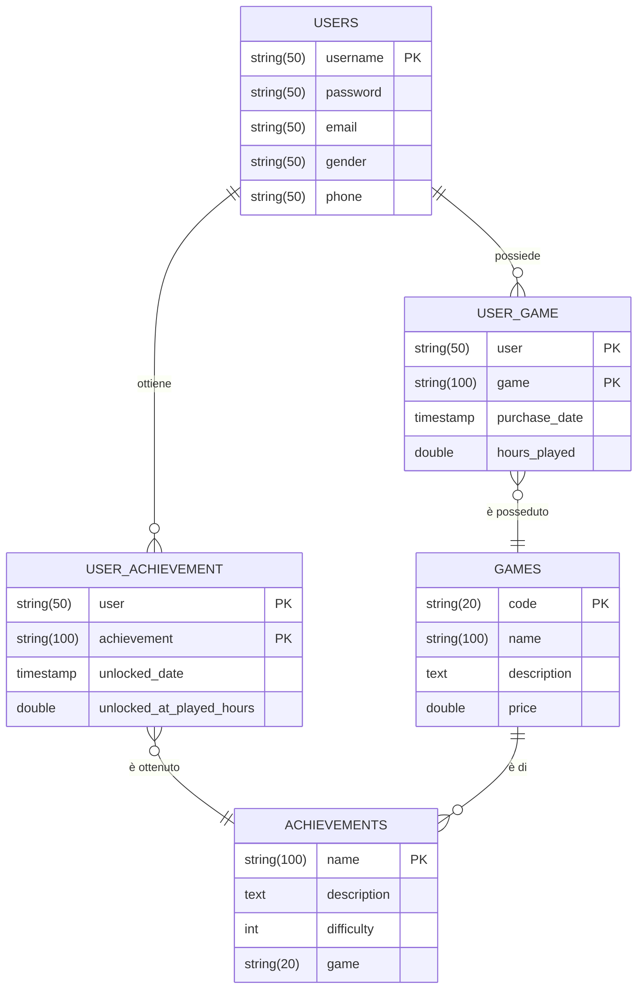

# Progetto BD2
Authors:
* Iacopo Filiberto <iacopo.filiberto@gmail.com> (S4472942)
* Davide Cardo <davidecardo98@gmail.com> (S4516525)

## PARTE A
### 1
Come DBMS abbiamo scelto di utilizzare PostgreSQL 18.
Nella versione 18 di Postgres sono abilitate di default le Parallel Query; 
quest'ultime, se ritenute dall'ottimizzatore appropriate, sono legate a dei query plan 
che sfruttano multiple CPU in modo da poter rispondere in modo più veloce alla query.
Nel nostro caso abbiamo disabilitato questo comportamento in quanto, per avere un rallentameno percepibile di una Parallel Query,
è necessario avere un dataset molto più grosso di quello che abbiamo generato; 
per disabilitare è stata impostata la variabile di configurazione `max_parallel_workers_per_gather` a `0`.

### 2
#### i
Abbiamo scelto di modellare una possibile base dati di un sito web volto al
tenere traccia degli obbiettivi di videogiochi ottenuti dagli utenti della piattaforma.


#### ii
#### iii
Per verificare che il numero di pagine sia corretto:
1. Otteniamo la size di una pagina del sistema eseguendo la query `SELECT current_setting('block_size')::BIGINT;` (nel nostro caso una pagina è grossa 8192 bytes)
2. Per ottenere il numero di pagine di una tabella possiamo eseguire la seguente query:
    ```sql
    SELECT pg_relation_size('table_name') / current_setting('block_size')::BIGINT AS page_count
    ```

| tabella | righe | bytes |
|---|---|---|
| achievements | 142595 | 8581 |
| games | 50000 | 5451 |
| user_achievements | 1004847 | 20112 |
| user_game | 1281383 | 15448 |


#### iv
Per popolare il database con dei dati è stato scritto uno script in javascript che genera 
uno script SQL contenente tutte le INSERT necessarie per popolare il database.
Lo script si trova dentro la cartella `data_generator`, per lanciarlo basta eseguire il comando `npm run start`.
Lo script si appoggia alla libreria `faker` per generare dei dati verosimili.

## PARTE B
### 1
1) Query che restituisce gli utenti e il numero di giochi che posseggono i quali possiedono almeno un achievements
```sql
-- Condizioni rispettate : a, c, d, e, g,
SELECT u.username, COUNT(ug.user)
FROM users u
     JOIN user_game ug ON ug.user = u.username
     JOIN games g ON g.code = ug.game
WHERE g.code = ANY(SELECT a.game FROM achievements a WHERE a.game = g.code)
GROUP BY u.username
ORDER BY u.username;
```

2) Seleziona tutti gli utenti che hanno giocato più di 449 ore ad un gioco
```sql
-- Condizioni rispettate: b, c, d, i
SELECT u.username, g.name, ug.hours_played
FROM users u
    JOIN user_game ug on u.username = ug."user"
    JOIN games g on g.code = ug.game
WHERE ug.hours_played > 449;
```

3) Seleziona tutti i giochi il cui prezzo è maggiore della media dei prezzi.
```sql
-- Condizione rispettata: f
SELECT name, price FROM games WHERE price >= (SELECT avg(price) FROM games);
```

4) Seleziona tutti gli utenti che hanno giocato più di 449 ore ad un gioco e che costa tra 300 e 500
```sql
-- Condizioni rispettate: b, c, d, h, i
SELECT u.username, g.name, ug.hours_played
FROM users u
         JOIN user_game ug on u.username = ug."user"
         JOIN games g on g.code = ug.game
WHERE ug.hours_played > 449 AND g.price BETWEEN 300 AND 500;
```

5) Selezionare gli utenti che hanno sbloccato un achievement nelle prime 3 ore di gioco
```sql
-- Condizioni rispettate: a, c, m
SELECT DISTINCT u.username
FROM users u
    JOIN user_achievement ua on u.username = ua."user"
WHERE ua.unlocked_at_played_hours <= 3;
```

6) Query che restituisce gli utenti che possiedono almeno 10 giochi
```sql
-- Condizioni rispettate : a, c, e,
SELECT u.username, COUNT(ug.user)
FROM users u
         JOIN user_game ug ON ug.user = u.username
GROUP BY u.username
HAVING COUNT(ug.user) >= 10
ORDER BY u.username;
```

7) Selezionare il nome di tutti i giochi i quali hanno almeno 1/3 degli achievement non sbloccati
```sql
-- Condizioni rispettate: c, g,
SELECT
    g.name
FROM
    games g
JOIN
    (
        SELECT
            a.game AS game_code,
            COUNT(a.name) AS total_achievements,
            COUNT(CASE WHEN ua."user" IS NULL THEN 1 END) AS unlocked_by_zero_users
        FROM
            achievements a
        LEFT JOIN 
            user_achievement ua ON ua.achievement = a.name
        GROUP BY
            a.game
        HAVING 
            COUNT(DISTINCT ua.achievement) IS NOT NULL 
            OR COUNT(a.name) > 0
    ) AS AchCounts ON g.code = AchCounts.game_code
WHERE
    AchCounts.unlocked_by_zero_users >= (AchCounts.total_achievements / 3.0);
```
8) Selezionare gli utenti che hanno ottenuto un achievement di difficoltà = 5
```sql
-- Condizioni rispettate: a, c, d, m
SELECT DISTINCT u.username
FROM users u
    JOIN user_achievement ua on ua."user" = u.username
    JOIN achievements a on ua.achievement = a.name
WHERE a.difficulty = 5
ORDER BY u.username;
```
### 2
Innanzitutto sono stati creati gli indici che rappresentano le chiavi primarie
delle varie tabelle; questi indici possono essere utilizzati in tutte le join.
(`px_users` in quanto rappresenta la chiave
primaria di users;`px_games` in quanto rappresenta la chiave
primaria di games;`px_achievement` in quanto rappresenta la chiave primaria di
achievement;`px_user_game` in quanto rappresenta la chiave
primaria di user_game;`px_user_achievement` in quanto rappresenta 
la chiave primaria di user_achievement;)

L'indice composto `idx__user_games__hours_per_game_per_user` è stato creato per consentire di ottimizzare le ricerche che si basano sul numero di ore giocate per un utente (query 2 e query 4)

L'indice `idx__games__price` consente di ottimizzare le query basate sul prezzo di un gioco (query 3 e query 4)

L'indice `idx__user_achievement__hours` consente di ottimizzare le query basate
sul sapere quando un certo achievement è stato ottenuto. (query 5)

L'indice `idx__achievements__difficulty` consente di ottimizzare le query basate
sulla difficolta di un achievement. (query 8).

L'indice `idx__achievements__game` consente di ottimizzare le query basate
sul raggruppare gli achivement per giochi (query 7)

### 3
```sql
CREATE UNIQUE INDEX px_users ON users(username);
CREATE UNIQUE INDEX px_games ON games(code);
CREATE UNIQUE INDEX px_achievements ON achievements(name);
CREATE UNIQUE INDEX px_user_game ON user_game("user", game);
CREATE UNIQUE INDEX px_user_achievement ON user_achievement(achievement, "user");

CREATE INDEX idx__user_game__hours_per_game_per_user ON user_game(hours_played, game, "user");
CREATE INDEX idx__games__price ON games(price);
CREATE INDEX idx__user_achievement__hours ON user_achievement(unlocked_at_played_hours);
CREATE INDEX idx__achievements__difficulty ON achievements(difficulty);
CREATE INDEX idx__achievements__game ON achievements(game, name);
```
### 4


| query | prima | dopo |
|---|---|---|
| query 1 | 3039ms | 2750ms |
| query 2 | 428ms | 118ms |
| query 3 | 165ms | 59ms |
| query 4 | 358ms | 30ms |
| query 5 | 442ms | 303ms |
| query 6 | 1456ms | 678ms |
| query 7 | 7613ms | 2583ms |
| query 8 | 1198ms | 1151ms |

La maggior parte delle query ottengono un enorme beneficio dalla presenza degli
indici; per esempio nella query 7 gli indici consentono di evitare le due due full scan su user_achievement e achievements, oppure la query 4 che consente di effettura
la query sfruttando interamente gli indici.
Nelle query ad alta selettività (query 1, query 5, query 8) si può notare che il
miglioramento dato dalla presenza dello schema fisico è minimo. Questo è dovuto al fatto che, quando una select ritorna più del 5-10% delle tuple di una relazione, è 
meglio eseguire una seq scan rispetto che ad una index scan.

### 5
La relazione `users` ha come chiave l'attributo `username`, che rappresenta univocamente un utente nel sistema, gli attributi `password, email, gender, phone` vengono
determinati dallo username di un utente. Quindi esiste la funzione `{username} -> {password, email, gender, phone}`.

La relazione `games` ha come chiave l'attributo `code`, che rappresenta univocamente un gioco nel sistema, gli attributi `name, description, price` vengono determinati
dal codice di un gioco. 

La relazione `achievements` ha come chiave l'attributo `name` che rappresenta univocamente un obbietivo nel sistema, gli attributi `description, difficulty, game` vengono
determinati dal nome dell'obbiettivo.

Nella relazione `user_achievements` la chiave è la coppia `{user, achievement}`; 
gli attributi `unlocked_date, unlocked_at_played_hours` vengono determinati dalla chiave. Ogni tupla all'interno della tabella rappresenta il fatto che un utente abbia
ottenuto un determinato achievement in un determinato momento di un gioco.

Nella relazione `user_game` la chiave è la coppia `{user, game}`; Gli attributi `purchase_date, hours_played` vengono determinaati dalla chiave.
Ogni tupla all'interno della tabella rappresenta il fatto che un utente possieda un certo gioco.


Un miglioramento generale delle prestazioni potremmo otternelo denormalizzando il database, introducendo delle colonne id di tipo numerico (es. una sequence),
soprattutto per quelle tabelle che vengono usate frequentemente per `JOIN`;
questo tipo di miglioramento è legato alla maggiore efficienza dei confronti su valori di tipo numerici piuttosto che di tipo stringa.

### 6


## PARTE C
## PARTE D
