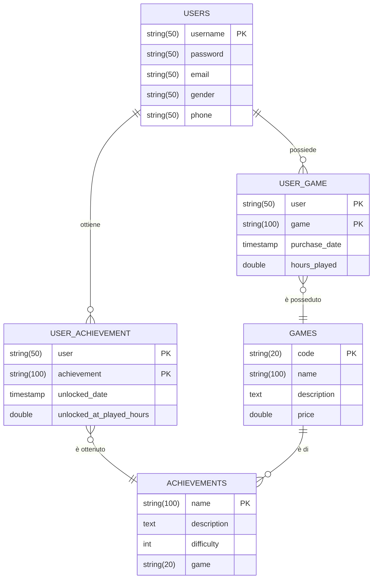

# Progetto BD2
Authors:
* Iacopo Filiberto <iacopo.filiberto@gmail.com> (S4472942)
* Davide Cardo <davidecardo98@gmail.com> (S4516525)

## PARTE A
### 1
Come DBMS abbiamo scelto di utilizzare PostgreSQL
### 2
#### i
Abbiamo scelto di modellare una possibile base dati di un sito web volto al
tenere traccia degli obbiettivi di videogiochi ottenuti dagli utenti della piattaforma.


#### ii
#### iii
Per verificare che il numero di pagine sia corretto:
1. Otteniamo la size di una pagina del sistema eseguendo la query `SELECT current_setting('block_size')::BIGINT;` (nel nostro caso una pagina è grossa 8192 bytes)
2. Per ottenere il numero di pagine di una tabella possiamo eseguire la seguente query:
    ```sql
    SELECT pg_relation_size('table_name') / current_setting('block_size')::BIGINT AS page_count
    ```

#### iv
Per popolare il database con dei dati è stato scritto uno script in javascript.
Lo script si trova dentro la cartella `data_generator`, per lanciarlo basta eseguire il comando `npm run start`.
Lo script si appoggia alla libreria `faker` per generare dei dati verosimili.

## PARTE B
### 1
1) Query che restituisce gli utenti e il numero di giochi che posseggono i quali possiedono almeno un achievements
```sql
-- Condizioni rispettate : a, c, d, e, g,
SELECT u.username, COUNT(ug.user)
FROM users u
     JOIN user_game ug ON ug.user = u.username
     JOIN games g ON g.code = ug.game
WHERE g.code = ANY(SELECT a.game FROM achievements a WHERE a.game = g.code)
GROUP BY u.username
ORDER BY u.username;
```

2) Seleziona tutti gli utenti che hanno giocato più di 449 ore ad un gioco
```sql
-- Condizioni rispettate: b, c, d, i
SELECT u.username, g.name, ug.hours_played
FROM users u
    JOIN user_game ug on u.username = ug."user"
    JOIN games g on g.code = ug.game
WHERE ug.hours_played > 449;
```

3) Seleziona tutti i giochi il cui prezzo è maggiore della media dei prezzi.
```sql
-- Condizione rispettata: f
SELECT name, price FROM games WHERE price >= (SELECT avg(price) FROM games);
```

4) Seleziona tutti gli utenti che hanno giocato più di 449 ore ad un gioco e che costa tra 300 e 500
```sql
-- Condizioni rispettate: b, c, d, h, i
SELECT u.username, g.name, ug.hours_played
FROM users u
         JOIN user_game ug on u.username = ug."user"
         JOIN games g on g.code = ug.game
WHERE ug.hours_played > 449 AND g.price BETWEEN 300 AND 500;
```

5) Selezionare gli utenti che hanno sbloccato un achievement nelle prime 3 ore di gioco
```sql
-- Condizioni rispettate: a, c, m
SELECT DISTINCT u.username
FROM users u
    JOIN user_achievement ua on u.username = ua."user"
WHERE ua.unlocked_at_played_hours <= 3;
```

6) Query che restituisce gli utenti che possiedono almeno 10 giochi
```sql
-- Condizioni rispettate : a, c, e,
SELECT u.username, COUNT(ug.user)
FROM users u
         JOIN user_game ug ON ug.user = u.username
GROUP BY u.username
HAVING COUNT(ug.user) >= 10
ORDER BY u.username;
```

7) Selezionare il nome di tutti i giochi i quali hanno almeno 1/3 degli achievement non sbloccati
```sql
-- Condizioni rispettate: c, g,
SELECT g.name
FROM games g
WHERE ((SELECT count(a.name)
        FROM achievements a
        WHERE a.game = g.code) / 3) <= (SELECT count(aos.achievement_name)
                                        FROM achievement_obtained_stats aos
                                            JOIN achievements a ON a.game = g.code AND aos.achievement_name = a.name
                                        WHERE user_count = 0);
```

8) Selezionare gli utenti che hanno ottenuto un achievement di difficoltà = 5
```sql
-- Condizioni rispettate: a, c, d, m
SELECT DISTINCT u.username
FROM users u
    JOIN user_achievement ua on ua."user" = u.username
    JOIN achievements a on ua.achievement = a.name
WHERE a.difficulty = 5
ORDER BY u.username;
```

## PARTE C
## PARTE D
