# Progetto BD2
Authors:
* Iacopo Filiberto <iacopo.filiberto@gmail.com> (S4472942)
* Davide Cardo <davidecardo98@gmail.com> (S4516525)

## PARTE A
### 1
Come DBMS abbiamo scelto di utilizzare PostgreSQL 18.
Nella versione 18 di Postgres sono abilitate di default le Parallel Query; 
quest'ultime, se ritenute dall'ottimizzatore appropriate, sono legate a dei query plan 
che sfruttano multiple CPU in modo da poter rispondere in modo più veloce alla query.
Nel nostro caso abbiamo disabilitato questo comportamento in quanto, per avere un rallentameno percepibile di una Parallel Query,
è necessario avere un dataset molto più grosso di quello che abbiamo generato; 
per disabilitare è stata impostata la variabile di configurazione `max_parallel_workers_per_gather` a `0`.

### 2
#### i
Abbiamo scelto di modellare una possibile base dati di un sito web volto al
tenere traccia degli obbiettivi di videogiochi ottenuti dagli utenti della piattaforma.

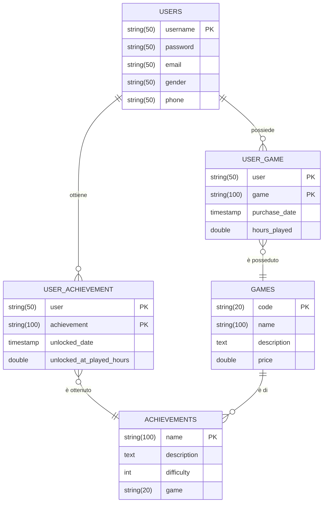
#### ii
#### iii
Per verificare che il numero di pagine sia corretto:
1. Otteniamo la size di una pagina del sistema eseguendo la query `SELECT current_setting('block_size')::BIGINT;` (nel nostro caso una pagina è grossa 8192 bytes)
2. Per ottenere il numero di pagine di una tabella possiamo eseguire la seguente query:
    ```sql
    SELECT pg_relation_size('table_name') / current_setting('block_size')::BIGINT AS page_count
    ```

| tabella | righe | bytes |
|---|---|---|
| achievements | 142595 | 8581 |
| games | 50000 | 5451 |
| user_achievements | 1004847 | 20112 |
| user_game | 1281383 | 15448 |


#### iv
Per popolare il database con dei dati è stato scritto uno script in javascript che genera 
uno script SQL contenente tutte le INSERT necessarie per popolare il database.
Lo script si trova dentro la cartella `data_generator`, per lanciarlo basta eseguire il comando `npm run start`.
Lo script si appoggia alla libreria `faker` per generare dei dati verosimili.

## PARTE B
### 1
1) Query che restituisce gli utenti e il numero di giochi che posseggono i quali possiedono almeno un achievements
```sql
-- Condizioni rispettate : a, c, d, e, g,
SELECT u.username, COUNT(ug.user)
FROM users u
     JOIN user_game ug ON ug.user = u.username
     JOIN games g ON g.code = ug.game
WHERE g.code = ANY(SELECT a.game FROM achievements a WHERE a.game = g.code)
GROUP BY u.username
ORDER BY u.username;
```

2) Seleziona tutti gli utenti che hanno giocato più di 449 ore ad un gioco
```sql
-- Condizioni rispettate: b, c, d, i
SELECT u.username, g.name, ug.hours_played
FROM users u
    JOIN user_game ug on u.username = ug."user"
    JOIN games g on g.code = ug.game
WHERE ug.hours_played > 449;
```

3) Seleziona tutti i giochi il cui prezzo è maggiore della media dei prezzi.
```sql
-- Condizione rispettata: f
SELECT name, price FROM games WHERE price >= (SELECT avg(price) FROM games);
```

4) Seleziona tutti gli utenti che hanno giocato più di 449 ore ad un gioco e che costa tra 300 e 500
```sql
-- Condizioni rispettate: b, c, d, h, i
SELECT u.username, g.name, ug.hours_played
FROM users u
         JOIN user_game ug on u.username = ug."user"
         JOIN games g on g.code = ug.game
WHERE ug.hours_played > 449 AND g.price BETWEEN 300 AND 500;
```

5) Selezionare gli utenti che hanno sbloccato un achievement nelle prime 3 ore di gioco
```sql
-- Condizioni rispettate: a, c, m
SELECT DISTINCT u.username
FROM users u
    JOIN user_achievement ua on u.username = ua."user"
WHERE ua.unlocked_at_played_hours <= 3;
```

6) Query che restituisce gli utenti che possiedono almeno 10 giochi
```sql
-- Condizioni rispettate : a, c, e,
SELECT u.username, COUNT(ug.user)
FROM users u
         JOIN user_game ug ON ug.user = u.username
GROUP BY u.username
HAVING COUNT(ug.user) >= 10
ORDER BY u.username;
```

7) Selezionare il nome di tutti i giochi i quali hanno almeno 1/3 degli achievement non sbloccati
```sql
-- Condizioni rispettate: c, g,
SELECT
    g.name
FROM
    games g
JOIN
    (
        SELECT
            a.game AS game_code,
            COUNT(a.name) AS total_achievements,
            COUNT(CASE WHEN ua."user" IS NULL THEN 1 END) AS unlocked_by_zero_users
        FROM
            achievements a
        LEFT JOIN 
            user_achievement ua ON ua.achievement = a.name
        GROUP BY
            a.game
        HAVING 
            COUNT(DISTINCT ua.achievement) IS NOT NULL 
            OR COUNT(a.name) > 0
    ) AS AchCounts ON g.code = AchCounts.game_code
WHERE
    AchCounts.unlocked_by_zero_users >= (AchCounts.total_achievements / 3.0);
```
8) Selezionare gli utenti che hanno ottenuto un achievement di difficoltà = 5
```sql
-- Condizioni rispettate: a, c, d, m
SELECT DISTINCT u.username
FROM users u
    JOIN user_achievement ua on ua."user" = u.username
    JOIN achievements a on ua.achievement = a.name
WHERE a.difficulty = 5
ORDER BY u.username;
```
### 2
Innanzitutto sono stati creati gli indici che rappresentano le chiavi primarie
delle varie tabelle; questi indici possono essere utilizzati in tutte le join.
(`px_users` in quanto rappresenta la chiave
primaria di users;`px_games` in quanto rappresenta la chiave
primaria di games;`px_achievement` in quanto rappresenta la chiave primaria di
achievement;`px_user_game` in quanto rappresenta la chiave
primaria di user_game;`px_user_achievement` in quanto rappresenta 
la chiave primaria di user_achievement;)

L'indice composto `idx__user_games__hours_per_game_per_user` è stato creato per consentire di ottimizzare le ricerche che si basano sul numero di ore giocate per un utente (query 2 e query 4)

L'indice `idx__games__price` consente di ottimizzare le query basate sul prezzo di un gioco (query 3 e query 4)

L'indice `idx__user_achievement__hours` consente di ottimizzare le query basate
sul sapere quando un certo achievement è stato ottenuto. (query 5)

L'indice `idx__achievements__difficulty` consente di ottimizzare le query basate
sulla difficolta di un achievement. (query 8).

L'indice `idx__achievements__game` consente di ottimizzare le query basate
sul raggruppare gli achivement per giochi (query 7)

### 3
```sql
CREATE UNIQUE INDEX px_users ON users(username);
CREATE UNIQUE INDEX px_games ON games(code);
CREATE UNIQUE INDEX px_achievements ON achievements(name);
CREATE UNIQUE INDEX px_user_game ON user_game("user", game);
CREATE UNIQUE INDEX px_user_achievement ON user_achievement(achievement, "user");

CREATE INDEX idx__user_game__hours_per_game_per_user ON user_game(hours_played, game, "user");
CREATE INDEX idx__games__price ON games(price);
CREATE INDEX idx__user_achievement__hours ON user_achievement(unlocked_at_played_hours);
CREATE INDEX idx__achievements__difficulty ON achievements(difficulty);
CREATE INDEX idx__achievements__game ON achievements(game, name);
```
### 4
#### Query 1
- Prima
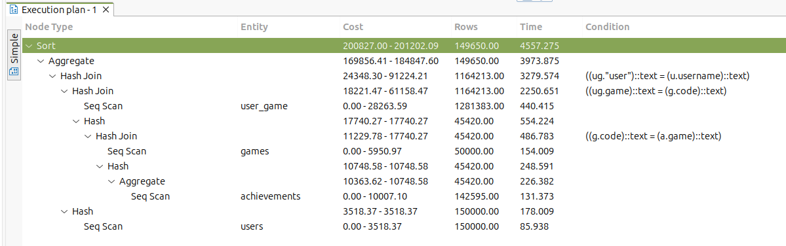
- Dopo
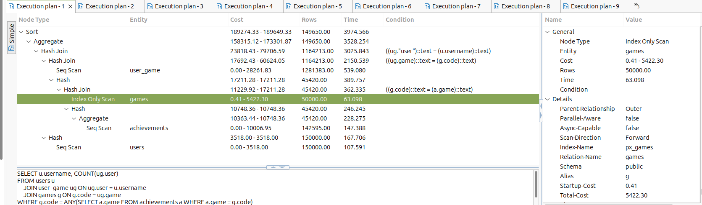
#### Query 2
- Prima
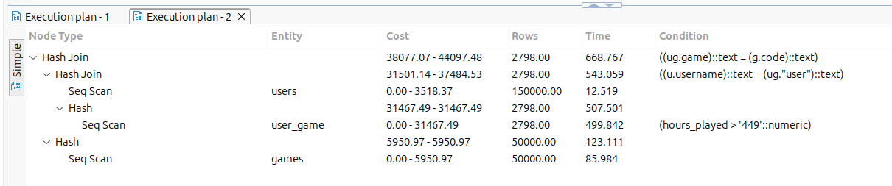
- Dopo
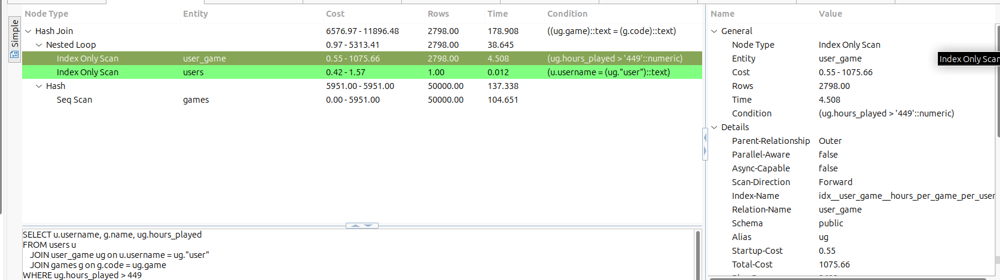
#### Query 3
- Prima
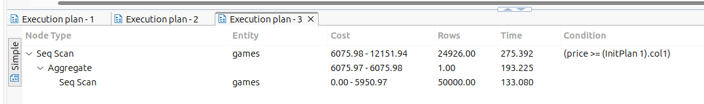
- Dopo
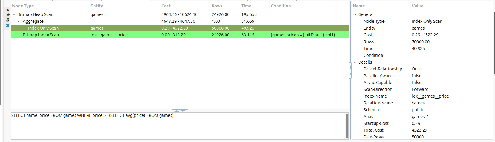
#### Query 4
- Prima
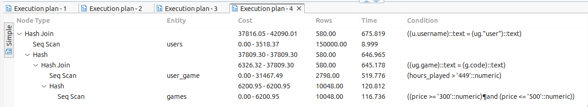
- Dopo
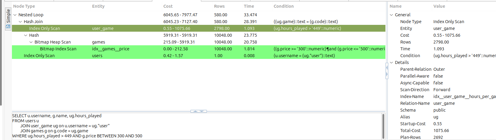
#### Query 5
- Prima
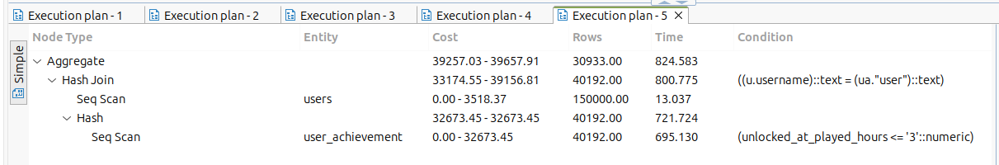
- Dopo
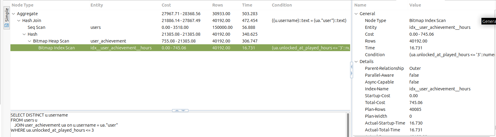
#### Query 6
- Prima
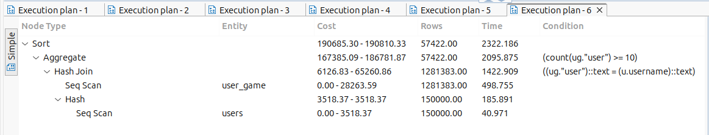
- Dopo
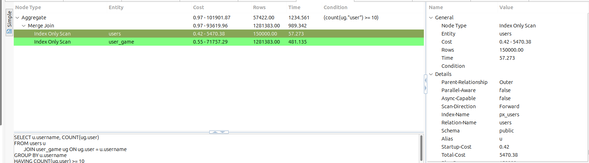
#### Query 7
- Prima
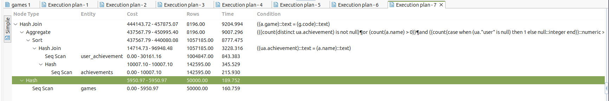
- Dopo
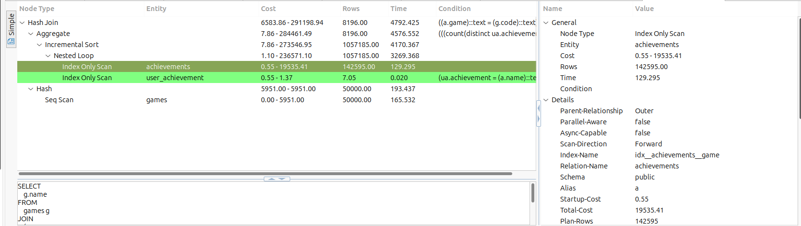
#### Query 8
- Prima
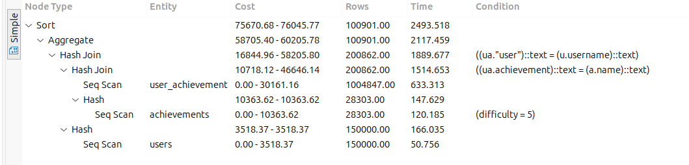
- Dopo
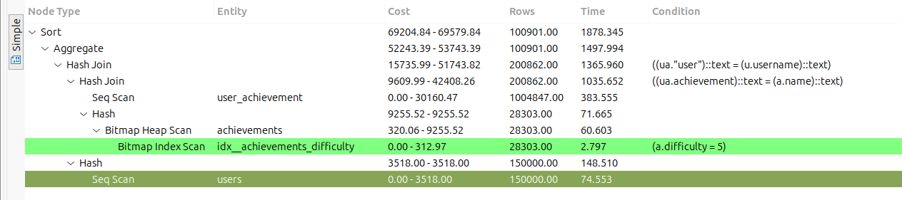

| query | prima | dopo |
|---|---|---|
| query 1 | 3039ms | 2750ms |
| query 2 | 428ms | 118ms |
| query 3 | 165ms | 59ms |
| query 4 | 358ms | 30ms |
| query 5 | 442ms | 303ms |
| query 6 | 1456ms | 678ms |
| query 7 | 7613ms | 2583ms |
| query 8 | 1198ms | 1151ms |

La maggior parte delle query ottengono un enorme beneficio dalla presenza degli
indici; per esempio nella query 7 gli indici consentono di evitare le due full scan su user_achievement e achievements, oppure la query 4 che consente di effettura
la query sfruttando interamente gli indici.
Nelle query ad alta selettività (query 1, query 5, query 8) si può notare che il
miglioramento dato dalla presenza dello schema fisico è minimo. Questo è dovuto al fatto che, quando una select ritorna più del 5-10% delle tuple di una relazione, è 
meglio eseguire una seq scan rispetto che ad una index scan.

### 5
La relazione `users` ha come chiave l'attributo `username`, che rappresenta univocamente un utente nel sistema, gli attributi `password, email, gender, phone` vengono
determinati dallo username di un utente. Quindi esiste la funzione `{username} -> {password, email, gender, phone}`.

La relazione `games` ha come chiave l'attributo `code`, che rappresenta univocamente un gioco nel sistema, gli attributi `name, description, price` vengono determinati
dal codice di un gioco. 

La relazione `achievements` ha come chiave l'attributo `name` che rappresenta univocamente un obbietivo nel sistema, gli attributi `description, difficulty, game` vengono
determinati dal nome dell'obbiettivo.

Nella relazione `user_achievements` la chiave è la coppia `{user, achievement}`; 
gli attributi `unlocked_date, unlocked_at_played_hours` vengono determinati dalla chiave. Ogni tupla all'interno della tabella rappresenta il fatto che un utente abbia
ottenuto un determinato achievement in un determinato momento di un gioco.

Nella relazione `user_game` la chiave è la coppia `{user, game}`; Gli attributi `purchase_date, hours_played` vengono determinaati dalla chiave.
Ogni tupla all'interno della tabella rappresenta il fatto che un utente possieda un certo gioco.


Un miglioramento generale delle prestazioni potremmo otternelo denormalizzando il database, introducendo delle colonne id di tipo numerico (es. una sequence),
soprattutto per quelle tabelle che vengono usate frequentemente per `JOIN`;
questo tipo di miglioramento è legato alla maggiore efficienza dei confronti su valori di tipo numerici piuttosto che di tipo stringa.

## PARTE C

### 1

#### Transazione 1
Creazione di nuovo gioco con un achievement, assegnato ad un gruppo di utenti che provano il gioco
  i. inserimento del nuovo gioco
  ii. inserimento del nuovo achievement
  iii. inserimento nella tabella `user_game` per legare il nuovo gioco ad alcuni utenti

Livello di isolamento: nel primo test *READ COMMITTED*, nel secondo test *SERIALIZABLE*
L'obiettivo è garantire di non far vedere dati a metà; `READ COMMITTED` è sufficiente per prevenire letture sporche, garantendo che la transazione
veda solo dati che sono stati committati da altre transazioni.

Condizioni rispettate: a,c,e,g

#### Transazione 2
Statistiche sui tempi legati ai giochi (tempo medio / tempo totale)  e classifica dei giocatori che hanno giocato di più
  i. Classifica dei giocatori che hanno giocato di più
  ii. Calcolo del tempo di gioco medio e totale per gioco
  iii. Classifica dei giocatori che hanno giocato di più (lettura ripetuta)

Livello di isolamento: nel primo test *REPEATABLE READ*, nel secondo test *SERIALIZABLE*
In questo caso abbiamo bisogno di un livello di isolamento che impedisca
ad altre transazioni di modificare la classifica tra la prima lettura e la seconda lettura.

Condizioni rispettate: a,c,f,h

#### Transazione 3
Gestione del progresso di un utente in un gioco che sblocca un obbiettivo
  i. Lettura delle ore di gioco attuali
  ii. Aggiornamento delle ore giocate
  iii. Inserimento di un nuovo obiettivo per l'utente

Livello di isolamento: in entrambi i test *SERIALIZABLE*
In questo caso abbiamo bisogno del livello massimo di isolamento, in quanto queste tre query hanno una dipendenza logica stretta.
Se una transazione (ad esempio un altro aggiornamento delle ore di gioco) intervenisse tra le operazioni, si potrebbe verificare un risultato inconsistente.

Condizioni rispettate: a,c,e,f,g

### 4
 PostgresSQL utilizza il protocollo MVCC (Multi-Version Concurrency Control) con l'SSI (Serializable Snapshot Isolation), che si basa sul fatto che al posto che mettere il lock, genera una snapshot della risorsa su cui si vuole effettuare la query. Se la transazione poi deve aggiornare dei dati (update/insert/delete), la transazione dovrà richiedere un certify lock per far si di rendere lo stato del db della snapshot, la nuova versione ufficiale.


Nel primo test, l'analisi dello scheduling fornito rivela il comportamento tipico di PostgreSQL sotto carico, mettendo in luce come il motore gestisca la concorrenza tramite il protocollo MVCC con SSI e i diversi livelli di isolamento richiesti.
La caratteristica più evidente è che le Transaction1 (T1) e le Transaction3 (T3) iniziano e terminano molto rapidamente, mentre le Transaction2 (T2) rimangono attive per periodi molto lunghi (anche minuti).  
Una transazione T2 esegue aggregazioni pesanti (SUM, AVG, GROUP BY) sull'intera tabella user_game; mentre  quest'ultime calcolano questi dati, T1 e T3 continuano a inserire e modificare righe, ma grazie ai protocolli usati, le query in lettura non bloccano le query di scrittura di altre transazioni e viceversa. T2 continua a lavorare sulla sua SNAPSHOT dei dati mentre il database cambia.

Transaction 1: Read Committed
È il livello di default in PostgresSQL. Ogni query all'interno di T1 vede una snapshot aggiornata al momento dell'inizio della query stessa.
Comportamento: T1 esegue tre INSERT di cui una composta da una select. Quest'ultima operazione può essere lenta se la tabella users è grande, ma nello scheduling vediamo che T1 termina solitamente in 1-2 secondi.

Transaction 2: Repeatable Read (Read Only)
Essendo REPEATABLE READ, Postgres garantisce che la transazione veda solo i dati commitati nel momento esatto in cui è iniziata la prima query. Come detto antecedentemente per fare ciò, PostgresSQL non blocca le tabelle, ma usa una Snapshot.
Comportamento: T2 esegue tre query pesanti. La seconda query (l'aggregazione totale per gioco) richiede una scansione sequenziale di user_game. Queste tre query sono tutte query di selezione e in PostgresSQL, non bloccano le altre transazioni (T1 e T3) di proseguire essendo il livello di isolamento Repeatable Read. 

Transaction 3: Serializable
Questo è il livello più restrittivo. Invece di bloccare le righe preventivamente, monitora le dipendenze tra transazioni (Read/Write dependencies).
Comportamento di T3: Legge hours_played, lo aggiorna e inserisce un achievement.
T3 non sembra fallire con errori di serializzazione (che porterebbero a un rollback). Questo accade perché probabilmente ogni thread T3 agisce su un utente diverso (user_1 è un esempio, ma nel test reale i parametri variano probabilmente per thread). Se due T3 lavorassero contemporaneamente sullo stesso utente e gioco, Postgres abortirebbe una delle due per prevenire anomalie.


### 5


Nel secondo test, il livello di isolamento di tutte le transazioni è stato cambiato in SERIALIZABLE. PostgreSQL introduce un cambiamento fondamentale nella gestione interna, facendo si che lo scheduling sembri mantenere una struttura simile al test precedente.
In PostgreSQL il livello SERIALIZABLE non usa lock pesanti per bloccare le risorse (come farebbe un protocollo basato su lock a due fasi rigido - 2PL), ma utilizza l'SSI (Serializable Snapshot Isolation) che è un protocollo ottimistico. 
PostgreSQL permette l'esecuzione parallela e controlla solo al momento del COMMIT se si è verificata un'anomalia di serializzazione

Nello scheduling notiamo che le T1 e le T3 continuano a terminare rapidamente nonostante le T2 stiano leggendo l'intera tabella. Anche in modalità SERIALIZABLE, PostgreSQL permette alle query in lettura di non bloccare le query di scrittura di altre transazioni.

Poiché non vediamo errori di rollback nel log (tutte terminano con terminated), significa che PostgreSQL ha stabilito che l'ordine temporale delle operazioni non ha creato cicli di dipendenza. Ad esempio, se T2 legge i dati prima che T1 inserisca il nuovo gioco, e T2 non ha bisogno di quel nuovo gioco per la sua coerenza interna, la transazione procede.

### 6
Il software è impostato in modo che crei un checkpoint all'inizio della transazione, prima di eseguire gli statement, e di ripristinarlo in caso di commit fallito.

Per scelta, un eventuale statement in errore viene semplicemente saltato, non compromettetendo l'intera transazione. In un contesto reale potrebbe non essere la scelta migliore, ma data la natura di questo progetto abbiamo preferito adoperare questo comportamento. Ad ogni modo, in tutti i test eseguito non è mai capitato di ricevere alcun errore.

## PARTE D
In PostgresSQL ruoli e utenti sono la stessa cosa. La differenza tra di essi è per lo più concettuale e solitamente vengono distinti solamente dal fatto che un utente è un ruolo con il flag *rolcanlogin* a true (quindi un ruolo che può fare la login). Tutte le informazioni rigurdanti i ruoli/utenti si trovano nella tabella *pg_roles*.

### 1
Per questa base dati sono stati creati quattro ruoli:
- base_user (utente base che utilizza l'applicazione)
- game_owner (può creare giochi e gestirli, in più può creare achievements per i suoi giochi)
- support (da supporto a user e game_owner)
- data_admin (è l'utente che possiede tutti i ruoli ed è l'amministratore di questo dominio. Non è l'admin vero e proprio della base dati, ma semplicemente possiede tutti i ruoli e permessi degli altri utenti)

L'eredità dei ruoli è definita nel seguente modo:
data_admin > support > base_user, game_owner

### 2 e 3
Tutti comandi SQL sono prensenti nel file [access.sql](../src/main/sql/access.sql).

Per il secondo e terzo punto sono stati definiti otto utenti a cui sono stati legati determinati ruoli:
- anna (base_user)
- maria (base_user)
- davide (game_owner)
- lorenzo (game_owner)
- giampiero (support)
- jotaro (data_admin)
- iacopo (base_user)
- luca (base_user)

La creazione di un utente e l'attribuzione di un ruolo ad esso sono stati attribuiti tramite i comandi *CREATE ROLE*, *CREATE USER*, *GRANT* seguendo la seguente grammatica:

```sql
CREATE ROLE role;
CREATE ROLE superRole;
GRANT role TO superRole;
CREATE USER user WITH PASSWORD 'secret_password';
GRANT role TO user;
```

### 4
```sql
CREATE VIEW game_owned_stats as SELECT g.name as game_name, COUNT(ug.game) as user_count
                                FROM games g
                                         JOIN user_game ug on ug.game = g.code
                                GROUP BY g.name;
grant select on game_owned_stats to iacopo;
```sql

### 5
Per il quinto punto, tramite l'utilizzo del comando *REVOKE* abbiamo inizialmente rimosso un permesso ad un ruolo (rimosso il permesso *select* dal ruolo game_owner)
```sql
REVOKE select ON achievement_obtained_stats FROM game_owner;
```
Successivamente abbiamo rimosso l'ereditarietà di un ruolo da un altro ruolo (il ruolo support non è più anche un game_owner)
```sql
REVOKE game_owner FROM support;
```

Come ultima operazione, abbiamo attribuito il permesso di *delete* sulla tabella *t1* ad un utente con in più l'opzione **GRANT OPT**, ovvero la possibilità da parte di questo utente di assegnare a sua volta questo permesso a qualcun altro. Tramite il comando *SET ROLE* abbiamo assunto il ruolo dell'utente scelto e abbiamo attribuito il permesso di *delete* sulla tabella *t1* ad un altro utente (senza l'opzione *GRANT OPT*); finita questa operazione, siamo tornati al ruolo che possedevamento all'inizio tramite il comando *RESET ROLE*

Per terminare abbiamo usato il comando *REVOKE* per rimuovere il permesso *delete* al primo utente e tramite l'utilizzo dell'opzione **CASCADE**, il permesso è stato rimosso anche al secondo utente a cui era stato attribuito il permesso dal primo utente. Se non avessimo usato l'opzione **CASCADE** il comando sarebbe fallito essendo se non specificato, viene usata l'opzione **RESTRICT** che non permette di rimuovere un permesso ad un utente che a sua volta ha assegnato lo stesso permesso ad un altro.
```sql
GRANT delete ON user_achievement TO iacopo WITH GRANT OPTION;
SET ROLE iacopo;
GRANT delete ON user_achievement TO luca;
RESET ROLE;
REVOKE delete ON user_achievement FROM iacopo CASCADE;
```

Il comando *REVOKE* non rimuove tutti i permessi p attribuiti da tutti gli utenti, ma solamente il permesso p assegnato dall'utente che esegue il comando.

Facendo un esempio: ipotizzando che il permesso p sia stato assegnato dall'utente *a* all'utente/ruolo *b*, e lo stesso permesso sia stato assegnato anche dall'utente *c*, se l'utente *a* revocasse il permesso p all'utente *b*, quest'ultimo continuerebbe ad avere il permesso p, essendo che gli è stato assegnato dall'utente *c*
